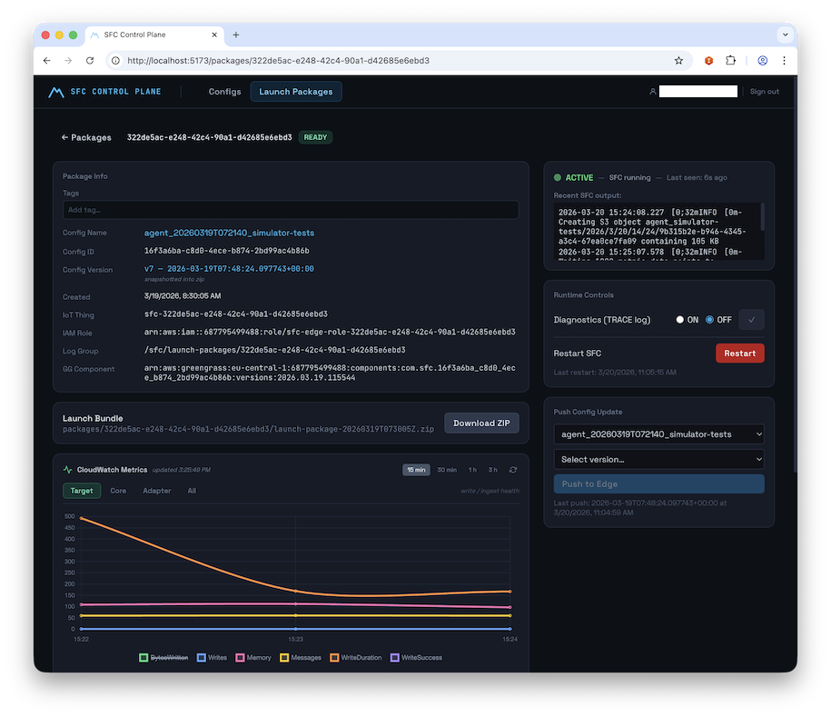

SFC Agentic Control Plane
=========================


---

## Table of Contents
- [**Deployment & Quickstart**](#deployment--quickstart)
  - [1. Deploy the CDK Stack](#1-deploy-the-cdk-stack)
  - [2. Access the CloudFront App](#2-access-the-cloudfront-app)
  - [3. Log in with Cognito](#3-log-in-with-cognito)
- [User Task & Action Sequence](#user-task--action-sequence)
  - [Sequence Legend](#sequence-legend)
    - [Phase 1 — Config Creation](#phase-1--config-creation)
    - [Phase 2 — Focus & Launch Package Creation](#phase-2--focus--launch-package-creation)
    - [Phase 3 — Edge Deployment](#phase-3--edge-deployment)
    - [Phase 4 — Runtime Monitoring & Control](#phase-4--runtime-monitoring--control)
    - [Phase 5 — AI-Assisted Remediation](#phase-5--ai-assisted-remediation)
- [Test the SFC Config Agent (AWS CLI)](#test-the-sfc-config-agent-aws-cli)
- [Launch Packages](#launch-packages)
- [Runtime Controls & Monitoring](#runtime-controls--monitoring)
- [AI-Assisted Remediation](#ai-assisted-remediation)
- [AI-Guided Config Generation](#ai-guided-config-generation)
- [MCP Server — SFC Specification Tools](#mcp-server--sfc-specification-tools)
- [Agent Tools (Internal)](#agent-tools-internal)
- [`aws-sfc-runtime-agent` (Edge)](#aws-sfc-runtime-agent-edge)
- [IoT Security Model](#iot-security-model)
- [Project Structure](#project-structure)
- [Appendix — Local Development UI Setup](#appendix--local-development-ui-setup)
  - [ui/.env.local — required variables](#uienvlocal--required-variables)
  - [Primary operator workflow](#primary-operator-workflow)
- [Appendix — Text descriptions](#appendix---text-descriptions)
  - [Executive Summary](#executive-summary)
  - [Pitch](#pitch)
  - [Abstract](#abstract)
  - [Capabilities & Ideas](#capabilities--ideas)

---

## Deployment & Quickstart

### 1. Deploy the CDK Stack

```bash
npm install
npx cdk deploy -c region=<YOUR_REGION>
```

> **Default region:** If `-c region=` is omitted, the stack falls back to the `CDK_DEFAULT_REGION` environment variable, then to `us-east-1`.

The CDK stack provisions all infrastructure and:
1. Uploads local sources to S3 for CodeBuild
2. Triggers the **AgentCore deployment** CodeBuild project (builds and registers the AI agent container)
3. Triggers the **UI build** CodeBuild project (runs `npm run build` for the Vite SPA and syncs assets to S3)
4. Serves the UI via **Amazon CloudFront** — the URL is printed as `SfcControlPlaneUiUrl`

Key CDK outputs:

| Output | Description |
|---|---|
| `SfcControlPlaneUiUrl` | CloudFront URL for the Control Plane SPA |
| `SfcControlPlaneApiUrl` | API Gateway endpoint |
| `CognitoHostedUiDomain` | Cognito Hosted UI base URL |
| `CognitoUserPoolId` | Cognito User Pool ID |
| `CognitoUserPoolClientId` | Cognito App Client ID |
| `SfcConfigBucketName` | S3 bucket (configs + packages + UI assets) |
| `SfcLaunchPackageTableName` | DynamoDB Launch Package table |
| `SfcControlPlaneStateTableName` | DynamoDB state table (focus config) |
| `AgentCoreMemoryId` | Short-term memory ID (also in SSM `/sfc-config-agent/memory-id`) |

---

### 2. Access the CloudFront App

Once `cdk deploy` completes, open the `SfcControlPlaneUiUrl` value printed in the stack outputs directly in your browser — no local setup required.

```
https://<distribution-id>.cloudfront.net
```

The SPA is fully served from CloudFront backed by an S3 bucket. The UI build is triggered automatically by the CDK deployment via CodeBuild.


*The SFC Control Plane UI*

---

### 3. Log in with Cognito

> **Note:** Self-sign-up is **disabled**. An administrator must create user accounts in the Cognito User Pool before anyone can log in.

**Create a user (admin — run after `cdk deploy`):**

```bash
export AWS_REGION=<YOUR-REGION>
export USER_POOL_ID=<CognitoUserPoolId>   # from cdk deploy output

aws cognito-idp admin-create-user \
  --user-pool-id "$USER_POOL_ID" \
  --username user@example.com \
  --user-attributes Name=email,Value=user@example.com Name=email_verified,Value=true \
  --temporary-password "Temp1234!" \
  --region "$AWS_REGION"
```

**First login flow:**

1. Open the `SfcControlPlaneUiUrl` CloudFront URL in your browser
2. You are automatically redirected to the **Cognito Hosted UI**
3. Enter your email and the temporary password
4. You are prompted to set a **permanent password** (min. 12 chars, requires uppercase, lowercase, digits, and a symbol)
5. After setting the password you are redirected back to the Control Plane app, fully authenticated

**Subsequent visits:** the app checks for a valid session on load and redirects to the Hosted UI automatically if the session has expired (token validity: 8 hours; refresh token: 30 days).

---

## Launch Packages

A **Launch Package** is a self-contained zip assembled by the Control Plane — everything needed to run SFC on an edge host:

```
launch-package-{packageId}.zip
├── sfc-config.json          # SFC config with IoT credential provider injected
├── iot/                     # X.509 device cert, private key, Root CA, iot-config.json
├── runner/                  # aws-sfc-runtime-agent (uv / Python 3.12)
└── docker/                  # Optional Dockerfile + build script
```

**Run on the edge host:**

```bash
unzip launch-package-<id>.zip
cd runner && uv run runner.py
```

The `aws-sfc-runtime-agent` handles IoT mTLS credential vending, SFC subprocess management, OTEL log shipping to CloudWatch, and the MQTT control channel back to the cloud.

---

## Runtime Controls & Monitoring

Once a package is `READY`, operators control the live edge device from the Package Detail view:

| Control | Description |
|---|---|
| **Telemetry on/off** | Enable/disable OTEL CloudWatch log shipping |
| **Diagnostics on/off** | Switch SFC log level to TRACE |
| **Push Config Update** | Send a new config version to the edge over MQTT |
| **Restart SFC** | Graceful SFC subprocess restart |

A live **status LED** (green `ACTIVE` / red `ERROR` / grey `INACTIVE`) reflects device heartbeat, polled every 10 s.

---

## AI-Assisted Remediation

When ERROR-severity records appear in the log viewer:

1. Click **"Fix with AI"** and select the error time window
2. The backend invokes the **Bedrock AgentCore SFC Config Agent** with the error logs + current config
3. A side-by-side diff of the corrected config is shown
4. Click **"Create New Launch Package"** — deploys the fixed config as a new package

---

## AI-Guided Config Generation

From the Config Browser, operators can also trigger an AI-guided config creation workflow:

1. Describe the machine, protocol, target AWS service, and data channels in natural language — or upload an existing spec file as context
2. Optionally provide structured fields: protocol, host/port targets, sampling interval
3. The agent calls the MCP server to load relevant SFC adapter and target documentation, generates a config, validates it, and saves it to S3/DynamoDB
4. A job ID is returned immediately (HTTP 202); the UI polls `GET /configs/generate/{jobId}` until status is `COMPLETE`
5. The new config appears in the Config Browser, ready to be set as Focus and packaged

---

## User Task & Action Sequence

The diagram below shows the complete operator journey — from an empty text box to a monitored, self-healing edge SFC process — and maps every UI action to the underlying Control Plane API call.

The workflow is organised into **5 phases**:

**Phase 1 — Config Creation**
An operator either edits an SFC configuration manually in the Monaco JSON editor (`PUT /configs/{id}`) or triggers the AI wizard which invokes the Bedrock AgentCore agent asynchronously. The agent uses the co-deployed FastMCP server to load live SFC adapter/target documentation from GitHub, generates a validated config, and saves it to S3 + DynamoDB. The UI polls `GET /configs/generate/{jobId}` until the job completes and the new config appears in the browser.

**Phase 2 — Focus & Launch Package Creation**
The operator pins a specific config version as "Focus" (`POST /configs/{id}/focus`), making it unambiguous which version the next package will be built from. Clicking "Create Launch Package" triggers a synchronous orchestration step: the control plane provisions a unique AWS IoT Thing, mints an X.509 device certificate, creates a scoped IAM role alias for credential vending, and assembles a self-contained `launch-package.zip`. The UI polls until status transitions to `READY`.

**Phase 3 — Edge Deployment**
The operator downloads the zip via a pre-signed S3 URL, unpacks it on any edge host (Windows, Mac, or Linux), and runs a single command: `uv run runner.py`. The `aws-sfc-runtime-agent` exchanges the device certificate for short-lived IAM credentials via the IoT Credential Provider (mTLS), downloads the correct SFC binary version, launches SFC as a managed subprocess, subscribes to the MQTT5 control channel, and begins publishing a heartbeat every 5 seconds.

**Phase 4 — Runtime Monitoring & Control**
The UI polls the heartbeat endpoint every 10 seconds, driving a live status LED (🟢 ACTIVE / 🔴 ERROR / ⚫ INACTIVE). From the Package Detail page the operator can view colour-coded OTEL log events, toggle CloudWatch log shipping on/off, switch SFC to TRACE-level diagnostics, push a new config version over the air via MQTT, or trigger a graceful SFC subprocess restart — all without touching the edge host.

**Phase 5 — AI-Assisted Remediation**
When ERROR-severity log lines appear, a single "Fix with AI" click opens a time-window selector. The backend fetches the error events and invokes the AgentCore agent with the error window and the current SFC config. The agent cross-references the errors against the live SFC spec via MCP, generates a corrected config, validates it, and returns it as a side-by-side diff. One more click creates a new Launch Package from the corrected config, with `sourcePackageId` preserving the full lineage back to the failed deployment.

---



```mermaid
sequenceDiagram
    autonumber
    participant Op as 👤 Operator
    participant UI as 🖥️ UI (SPA)
    participant API as ☁️ Control Plane API
    participant AI as 🤖 AI Agent + MCP
    participant IoT as 🔒 IoT Core
    participant Edge as 📦 Edge Device

    %% ── PHASE 1 ── Config Creation ───────────────
    Note over Op,AI: ━━━━━━━━━━━━━━━━━━━━  PHASE 1 — Config Creation  ━━━━━━━━━━━━━━━━━━━━
    Op->>UI: [1] Open Config Browser (/)
    UI->>API: GET /configs
    API-->>UI: Config list (latest version per configId)
    UI-->>Op: Display config list

    alt [2a] Manual Edit
        Op->>UI: Open config in Monaco editor (/configs/:id)
        UI->>API: GET /configs/{configId}
        API-->>UI: Config JSON + version metadata
        Op->>UI: Edit JSON, click Save
        UI->>API: PUT /configs/{configId}
        API-->>UI: New version saved (ISO timestamp)
        UI-->>Op: Updated version shown in editor
    else [2b] AI-Guided Generation
        Op->>UI: Click "Generate with AI" → fill wizard
        Note right of Op: Describe machine, protocol,<br/>targets, sampling interval
        UI->>API: POST /configs/generate {prompt, protocol, …}
        API->>AI: Invoke AgentCore runtime (async) — HTTP 202 {jobId}
        AI->>AI: MCP: load adapter + target docs
        AI->>AI: Generate config JSON
        AI->>AI: MCP: validate_sfc_config
        AI->>API: save_config_to_file → S3 + DynamoDB
        loop [3] Poll until COMPLETE
            UI->>API: GET /configs/generate/{jobId}
            API-->>UI: {status: "PENDING" | "COMPLETE"}
        end
        UI-->>Op: New config appears in Config Browser
    end

    %% ── PHASE 2 ── Focus & Package Creation ──────
    Note over Op,IoT: ━━━━━━━━━━━━━━  PHASE 2 — Focus & Launch Package Creation  ━━━━━━━━━━━━━━
    Op->>UI: [4] Click "Set as Focus" on a config version
    UI->>API: POST /configs/{configId}/focus {version}
    API-->>UI: Focus saved (ControlPlaneStateTable)
    UI-->>Op: Focus Banner shows active config

    Op->>UI: [5] Click "Create Launch Package"
    UI->>API: POST /packages {configId, configVersion}
    API->>IoT: [6] Provision IoT Thing + X.509 cert + policy
    IoT-->>API: certArn, privateKey, iotEndpoint
    API->>API: Assemble launch-package.zip (config, certs, runner, docker)
    API->>IoT: Create role alias → scoped IAM role
    API-->>UI: {packageId, status: "PROVISIONING"}
    loop [7] Poll until READY
        UI->>API: GET /packages/{packageId}
        API-->>UI: {status: "PROVISIONING" | "READY" | "ERROR"}
    end
    UI-->>Op: Package status → READY ✅

    %% ── PHASE 3 ── Edge Deployment ───────────────
    Note over Op,Edge: ━━━━━━━━━━━━━━━━━━━━  PHASE 3 — Edge Deployment  ━━━━━━━━━━━━━━━━━━━━
    Op->>UI: [8] Click "Download"
    UI->>API: GET /packages/{packageId}/download
    API-->>UI: Pre-signed S3 URL
    UI-->>Op: Browser downloads launch-package.zip

    Op->>Edge: [9] unzip + cd runner && uv run runner.py
    Edge->>IoT: [10] mTLS handshake with X.509 device cert
    IoT-->>Edge: Temporary AWS credentials (refreshed every 50 min)
    Edge->>Edge: Download SFC binaries from GitHub releases
    Edge->>Edge: Launch SFC subprocess
    Edge->>IoT: [11] Subscribe to sfc/{packageId}/control/+
    Edge->>IoT: [12] Publish heartbeat → sfc/{packageId}/heartbeat (every 5 s)
    IoT->>API: IoT Topic Rule → ingest heartbeat to DynamoDB

    %% ── PHASE 4 ── Monitoring & Control ──────────
    Note over Op,Edge: ━━━━━━━━━━━━━━━━  PHASE 4 — Runtime Monitoring & Control  ━━━━━━━━━━━━━━━━
    loop [13] Every 10 s
        UI->>API: GET /packages/{packageId}/heartbeat
        API-->>UI: {status: ACTIVE | ERROR | INACTIVE, sfcRunning, lastLines}
        UI-->>Op: Live status LED — ACTIVE / ERROR / INACTIVE
    end

    Op->>UI: [14] Open Log Viewer (/packages/:id/logs)
    UI->>API: GET /packages/{packageId}/logs?lookbackMinutes=30
    API-->>UI: Paginated OTEL log events (severity-coded)
    UI-->>Op: Live log stream

    Op->>UI: [15] Toggle Telemetry on/off
    UI->>API: PUT /packages/{packageId}/control/telemetry {enabled}
    API->>IoT: Publish MQTT control command
    IoT-->>Edge: Telemetry toggle received
    Edge-->>Edge: Start / stop OTEL CloudWatch export

    Op->>UI: [16] Toggle Diagnostics (TRACE level)
    UI->>API: PUT /packages/{packageId}/control/diagnostics {enabled}
    API->>IoT: Publish MQTT control command
    IoT-->>Edge: Log level → TRACE / INFO

    Op->>UI: [17] Push Config Update (select new version)
    UI->>API: POST /packages/{packageId}/control/config-update {configVersion}
    API->>IoT: Publish new config JSON over MQTT
    IoT-->>Edge: Receive updated config
    Edge-->>Edge: Hot-reload SFC config

    Op->>UI: [18] Click Restart SFC
    UI->>API: POST /packages/{packageId}/control/restart
    API->>IoT: Publish restart command
    IoT-->>Edge: Graceful SFC subprocess restart

    %% ── PHASE 5 ── AI Remediation ────────────────
    Note over Op,AI: ━━━━━━━━━━━━━━━━━━━━  PHASE 5 — AI-Assisted Remediation  ━━━━━━━━━━━━━━━━━━━━
    Op->>UI: [19] Spots ERROR lines in log viewer
    Op->>UI: Click "Fix with AI" → select error time window
    UI->>API: GET /packages/{packageId}/logs/errors?startTime=…&endTime=…
    API-->>UI: ERROR-severity log events

    UI->>API: [20] POST /packages/{packageId}/remediate {startTime, endTime}
    API->>AI: Invoke AgentCore with error logs + current config
    AI->>AI: MCP: analyse errors against SFC spec
    AI->>AI: Generate corrected config
    AI->>AI: MCP: validate_sfc_config
    AI-->>API: Corrected config JSON
    API-->>UI: {sessionId, status: "PENDING"}
    loop [21] Poll until COMPLETE
        UI->>API: GET /packages/{packageId}/remediate/{sessionId}
        API-->>UI: {status, correctedConfig}
    end
    UI-->>Op: Side-by-side diff of original vs corrected config

    Op->>UI: [22] Click "Create New Launch Package"
    UI->>API: POST /packages {configId, sourcePackageId (lineage)}
    API->>IoT: Provision new IoT Thing + cert
    API-->>UI: New package (READY) with lineage to failed deployment ✅
```

### Sequence Legend

> Step numbers correspond to the `autonumber` sequence in the diagram above.

#### Phase 1 — Config Creation

| # | Participant → | Message | Notes |
|---|---------------|---------|-------|
| 1 | Operator → UI | Open Config Browser `/` | Entry point of the operator workflow |
| 2 | UI → API | `GET /configs` | Fetches latest version per `configId` |
| 3 | API → UI | Config list response | Sorted list of all stored SFC configs |
| 4 | UI → Operator | Display config list | Rendered in the Config Browser page |
| 5 | Operator → UI | *(alt 2a)* Open config in Monaco editor `/configs/:id` | Manual edit path |
| 6 | UI → API | `GET /configs/{configId}` | Loads latest version metadata + S3 JSON content |
| 7 | API → UI | Config JSON + version metadata | |
| 8 | Operator → UI | Edit JSON, click Save | User edits in the Monaco JSON editor |
| 9 | UI → API | `PUT /configs/{configId}` | Saves new version; ISO timestamp used as version key |
| 10 | API → UI | New version saved (ISO timestamp) | DynamoDB record created; S3 object written |
| 11 | UI → Operator | Updated version shown in editor | |
| 12 | Operator → UI | *(alt 2b)* Click "Generate with AI" → fill wizard | AI-guided generation path |
| 13 | UI → API | `POST /configs/generate {prompt, protocol, …}` | Accepts free-text description, protocol, targets, sampling interval |
| 14 | API → AI | Invoke AgentCore runtime (async) — HTTP 202 `{jobId}` | Starts async Bedrock AgentCore session |
| 15 | AI → AI | MCP: load adapter + target docs | Pulls live SFC spec from GitHub via FastMCP server |
| 16 | AI → AI | Generate config JSON | LLM produces SFC configuration |
| 17 | AI → AI | MCP: `validate_sfc_config` | Validates against SFC schema before saving |
| 18 | AI → API | `save_config_to_file` → S3 + DynamoDB | Persists validated config; returns pre-signed URL |
| 19 | UI → API | *(loop)* `GET /configs/generate/{jobId}` | Polls until `status: COMPLETE` |
| 20 | API → UI | `{status: "PENDING" \| "COMPLETE"}` | |
| 21 | UI → Operator | New config appears in Config Browser | Poll exits; config is ready for use |

#### Phase 2 — Focus & Launch Package Creation

| # | Participant → | Message | Notes |
|---|---------------|---------|-------|
| 22 | Operator → UI | Click "Set as Focus" on a config version | Pinning a specific version for package creation |
| 23 | UI → API | `POST /configs/{configId}/focus {version}` | Writes to `ControlPlaneStateTable` singleton |
| 24 | API → UI | Focus saved | |
| 25 | UI → Operator | Focus Banner shows active config | Persistent banner visible across all UI pages |
| 26 | Operator → UI | Click "Create Launch Package" | Triggers full provisioning pipeline |
| 27 | UI → API | `POST /packages {configId, configVersion}` | Initiates IoT provisioning + zip assembly |
| 28 | API → IoT | Provision IoT Thing + X.509 cert + policy | Mints unique device certificate; attaches least-privilege IoT policy |
| 29 | IoT → API | `certArn`, `privateKey`, `iotEndpoint` | Provisioning artifacts returned to control plane |
| 30 | API → API | Assemble `launch-package.zip` (config, certs, runner, docker) | Zip built in-memory; stored to S3 |
| 31 | API → IoT | Create role alias → scoped IAM role | Enables credential vending from device cert |
| 32 | API → UI | `{packageId, status: "PROVISIONING"}` | Package record created in DynamoDB |
| 33 | UI → API | *(loop)* `GET /packages/{packageId}` | Polls until status transitions |
| 34 | API → UI | `{status: "PROVISIONING" \| "READY" \| "ERROR"}` | |
| 35 | UI → Operator | Package status → READY ✅ | Package is ready to download |

#### Phase 3 — Edge Deployment

| # | Participant → | Message | Notes |
|---|---------------|---------|-------|
| 36 | Operator → UI | Click "Download" | Initiates package download |
| 37 | UI → API | `GET /packages/{packageId}/download` | Requests pre-signed S3 URL |
| 38 | API → UI | Pre-signed S3 URL | URL expires after a short TTL |
| 39 | UI → Operator | Browser downloads `launch-package.zip` | Contains config, X.509 certs, runner, Dockerfile |
| 40 | Operator → Edge | `unzip` + `cd runner && uv run runner.py` | Starts `aws-sfc-runtime-agent`; no env vars needed |
| 41 | Edge → IoT | mTLS handshake with X.509 device cert | Authenticates device to AWS IoT Core |
| 42 | IoT → Edge | Temporary AWS credentials (refreshed every 50 min) | Short-lived IAM creds via IoT Credential Provider |
| 43 | Edge → Edge | Download SFC binaries from GitHub releases | Fetches correct SFC version declared in config |
| 44 | Edge → Edge | Launch SFC subprocess | SFC started as a managed child process |
| 45 | Edge → IoT | Subscribe to `sfc/{packageId}/control/+` | MQTT5 control channel subscription |
| 46 | Edge → IoT | Publish heartbeat → `sfc/{packageId}/heartbeat` (every 5 s) | Heartbeat includes `sfcRunning`, `sfcPid`, last 3 log lines |
| 47 | IoT → API | IoT Topic Rule → ingest heartbeat to DynamoDB | Topic rule writes `lastHeartbeatAt`, `sfcRunning`, `lastHeartbeatPayload` |

#### Phase 4 — Runtime Monitoring & Control

| # | Participant → | Message | Notes |
|---|---------------|---------|-------|
| 48 | UI → API | *(loop)* `GET /packages/{packageId}/heartbeat` | Polled every 10 s by the UI |
| 49 | API → UI | `{status: ACTIVE \| ERROR \| INACTIVE, sfcRunning, lastLines}` | Reads latest DynamoDB heartbeat record |
| 50 | UI → Operator | Live status LED — ACTIVE / ERROR / INACTIVE | Green / Red / Grey LED component |
| 51 | Operator → UI | Open Log Viewer `/packages/:id/logs` | Navigate to OTEL log stream page |
| 52 | UI → API | `GET /packages/{packageId}/logs?lookbackMinutes=30` | Supports `startTime`, `endTime`, `limit`, `lookbackMinutes` |
| 53 | API → UI | Paginated OTEL log events (severity-coded) | Events fetched from CloudWatch Logs via Lambda |
| 54 | UI → Operator | Live log stream | Colour-coded by severity in `OtelLogStream` component |
| 55 | Operator → UI | Toggle Telemetry on/off | Control panel action |
| 56 | UI → API | `PUT /packages/{packageId}/control/telemetry {enabled}` | Persists toggle state to DynamoDB |
| 57 | API → IoT | Publish MQTT control command | Topic: `sfc/{packageId}/control/telemetry` |
| 58 | IoT → Edge | Telemetry toggle received | |
| 59 | Edge → Edge | Start / stop OTEL CloudWatch export | `BatchLogRecordProcessor` enabled or disabled |
| 60 | Operator → UI | Toggle Diagnostics (TRACE level) | Control panel action |
| 61 | UI → API | `PUT /packages/{packageId}/control/diagnostics {enabled}` | Persists diagnostic toggle |
| 62 | API → IoT | Publish MQTT control command | Topic: `sfc/{packageId}/control/diagnostics` |
| 63 | IoT → Edge | Log level → TRACE / INFO | SFC subprocess log level changed live |
| 64 | Operator → UI | Push Config Update (select new version) | OTA update without re-deploying the package |
| 65 | UI → API | `POST /packages/{packageId}/control/config-update {configVersion}` | References an existing `configVersion` in DynamoDB |
| 66 | API → IoT | Publish new config JSON over MQTT | Topic: `sfc/{packageId}/control/config-update` |
| 67 | IoT → Edge | Receive updated config | |
| 68 | Edge → Edge | Hot-reload SFC config | SFC subprocess reloaded with new configuration |
| 69 | Operator → UI | Click Restart SFC | Graceful process restart |
| 70 | UI → API | `POST /packages/{packageId}/control/restart` | |
| 71 | API → IoT | Publish restart command | Topic: `sfc/{packageId}/control/restart` |
| 72 | IoT → Edge | Graceful SFC subprocess restart | SIGTERM sent; runner relaunches SFC |

#### Phase 5 — AI-Assisted Remediation

| # | Participant → | Message | Notes |
|---|---------------|---------|-------|
| 73 | Operator → UI | Spots ERROR lines in log viewer | ERROR-severity rows highlighted in red |
| 74 | Operator → UI | Click "Fix with AI" → select error time window | Opens remediation time-window selector |
| 75 | UI → API | `GET /packages/{packageId}/logs/errors?startTime=…&endTime=…` | Fetches only ERROR-severity OTEL events |
| 76 | API → UI | ERROR-severity log events | |
| 77 | UI → API | `POST /packages/{packageId}/remediate {startTime, endTime}` | Kicks off async AI remediation session |
| 78 | API → AI | Invoke AgentCore with error logs + current config | Sends full error window + config JSON to agent |
| 79 | AI → AI | MCP: analyse errors against SFC spec | Cross-references errors with live SFC documentation |
| 80 | AI → AI | Generate corrected config | LLM produces fix |
| 81 | AI → AI | MCP: `validate_sfc_config` | Validates corrected config before returning |
| 82 | AI → API | Corrected config JSON | |
| 83 | API → UI | `{sessionId, status: "PENDING"}` | Async session ID returned immediately |
| 84 | UI → API | *(loop)* `GET /packages/{packageId}/remediate/{sessionId}` | Polls until remediation completes |
| 85 | API → UI | `{status, correctedConfig}` | |
| 86 | UI → Operator | Side-by-side diff of original vs corrected config | Rendered by `RemediationConfirmDialog` component |
| 87 | Operator → UI | Click "Create New Launch Package" | Applies the AI-corrected config |
| 88 | UI → API | `POST /packages {configId, sourcePackageId (lineage)}` | `sourcePackageId` links new package to the failed one |
| 89 | API → IoT | Provision new IoT Thing + cert | Fresh X.509 credentials for the new package |
| 90 | API → UI | New package (READY) with lineage to failed deployment ✅ | Full audit trail preserved via `sourcePackageId` |

---

## Test the SFC Config Agent (AWS CLI)

The agent runs as an **Amazon Bedrock AgentCore Runtime**. After deployment, retrieve the runtime ARN and invoke it:

```bash
# 1. Get the AgentCore runtime ARN
export AWS_REGION=<YOUR-REGION>
AGENT_RUNTIME_ARN=$(aws bedrock-agentcore-control list-agent-runtimes \
  --region $AWS_REGION \
  --query "agentRuntimes[?agentRuntimeName=='sfc_config_agent'].agentRuntimeArn" \
  --output text)

echo '{"prompt": "Create an OPC-UA SFC config for a press machine with two data sources"}' > input.json

# 2. Invoke the agent
aws bedrock-agentcore invoke-agent-runtime \
  --agent-runtime-arn "$AGENT_RUNTIME_ARN" \
  --runtime-session-id "sfc-agent-my-session-01-20260225-0001" \
  --payload fileb://input.json \
  --region $AWS_REGION \
  --cli-read-timeout 0 \
  --cli-connect-timeout 0 \
  output.txt && cat output.txt
```

---

## MCP Server — SFC Specification Tools

The agent uses a co-deployed **FastMCP server** (`src/sfc-spec-mcp-server.py`) that reads directly from the [SFC GitHub repository](https://github.com/awslabs/industrial-shopfloor-connect). Available tools:

| Tool | Description |
|---|---|
| `update_repo` | Pull latest SFC spec from GitHub |
| `list_core_docs` / `get_core_doc` | Browse and read core SFC documentation |
| `list_adapter_docs` / `get_adapter_doc` | Browse and read protocol adapter docs |
| `list_target_docs` / `get_target_doc` | Browse and read AWS/edge target docs |
| `query_docs` | Cross-type doc search with optional content inclusion |
| `search_doc_content` | Full-text search across all SFC documentation |
| `extract_json_examples` | Extract parsed JSON config examples from docs |
| `get_sfc_config_examples` | Retrieve component-filtered config examples |
| `create_sfc_config_template` | Generate a typed config template for a protocol/target pair |
| `validate_sfc_config` | Validate a config JSON against SFC schema and knowledge base |
| `what_is_sfc` | Return a structured explanation of SFC capabilities |

Supported protocols: **OPC-UA, Modbus TCP, Siemens S7, MQTT, REST, SQL, SNMP, Allen-Bradley PCCC, Beckhoff ADS, J1939 (CAN Bus), Mitsubishi SLMP, NATS, OPC-DA, Simulator**

Supported AWS targets: **IoT Core, IoT Analytics, IoT SiteWise, S3, S3 Tables (Apache Iceberg), Kinesis, Kinesis Firehose, Lambda, SNS, SQS, Timestream, MSK**

Edge targets: **OPC-UA Server, OPC-UA Writer, Debug, File, MQTT Broker, NATS**

---

## Agent Tools (Internal)

In addition to the MCP tools, the agent has direct access to cloud storage via these built-in tools:

| Tool | Description |
|---|---|
| `read_config_from_file` | Read an SFC config from S3/DynamoDB by filename |
| `save_config_to_file` | Save a config JSON to S3 + DynamoDB; returns a pre-signed download URL |
| `save_results_to_file` | Save arbitrary content (txt, md, csv) to S3 |
| `save_conversation` | Export the last N conversation exchanges as markdown to S3 |
| `read_context_from_file` | Read any previously saved file as agent context |
| `retrieve_session_memory` | Fetch AgentCore Memory records for the current session |

---

## `aws-sfc-runtime-agent` (Edge)

The `runner/runner.py` inside each Launch Package is a self-contained uv-managed Python 3.12 application. It:

1. Reads `iot-config.json` for all runtime parameters (no environment overrides needed)
2. Exchanges the device X.509 certificate for temporary AWS credentials via the IoT Credential Provider (mTLS), refreshed every 50 minutes
3. Downloads SFC binaries from the [SFC GitHub releases](https://github.com/awslabs/industrial-shopfloor-connect/releases) for the version declared in the config
4. Launches SFC as a managed subprocess, capturing stdout/stderr line-by-line
5. Wraps each captured line as an OTEL `LogRecord` and exports to CloudWatch Logs via OTLP/HTTP (`BatchLogRecordProcessor`)
6. Maintains an MQTT5 control channel, subscribing to `sfc/{packageId}/control/+` for telemetry, diagnostics, config-update, and restart commands
7. Publishes a heartbeat every 5 seconds to `sfc/{packageId}/heartbeat` containing `sfcRunning`, `sfcPid`, toggle states, and the last 3 log lines
8. Handles `SIGTERM`/`SIGINT` with graceful OTEL flush, MQTT disconnect, and SFC subprocess termination

**CLI option:** `--no-otel` disables CloudWatch log export (useful for air-gapped environments).

**Docker support:** Each package includes a `Dockerfile` and `docker-build.sh` for containerised deployment on Amazon Corretto 21 + Alpine.

---

## IoT Security Model

Each Launch Package provisions a unique AWS IoT Thing with:

- A fresh X.509 device certificate and private key (stored in `packages/{packageId}/assets/` with IAM-scoped access)
- An IoT policy granting `iot:Connect`, `iot:Subscribe`, `iot:Receive` on the device's own MQTT topics, and `iot:Publish` to its heartbeat topic only
- A role alias enabling temporary credential vending scoped to the minimum IAM permissions derived from the SFC config's target types (IoT Core, SiteWise, Kinesis, S3, CloudWatch Logs)
- A permissions boundary on all dynamically created IAM roles to prevent privilege escalation

Certificate revocation (`DELETE /packages/{packageId}/iot`) is available as a first-class API operation.

---

## Project Structure

```
sample-sfc-agentic-control-plane/
├── README.md
├── cdk.json
├── package.json
├── tsconfig.json
├── bin/
│   └── app.ts                             # CDK app entrypoint
├── lib/
│   ├── sfc-control-plane-stack.ts         # Root CDK stack
│   └── constructs/
│       ├── control-plane-api.ts           # API GW + all Lambda functions + Cognito
│       ├── heartbeat-rule.ts              # IoT Topic Rule → DynamoDB heartbeat ingestion
│       ├── launch-package-tables.ts       # LaunchPackageTable + ControlPlaneStateTable
│       ├── sfc-config-agent-infra.ts      # NestedStack: all sfc-config-agent resources
│       └── ui-hosting.ts                  # CloudFront + S3 OAC construct
├── src/
│   ├── agent.py                           # AgentCore entrypoint (Strands + BedrockAgentCoreApp)
│   ├── requirements.txt                   # Python deps for the AgentCore container image
│   ├── Dockerfile.deps                    # System-level deps injected into the generated Dockerfile
│   ├── sfc-spec-mcp-server.py             # FastMCP server (SFC spec validation tools)
│   ├── sfc-config-example.json            # Reference SFC config
│   ├── openapi/
│   │   └── control-plane-api.yaml         # OpenAPI 3.0 spec (API GW source of truth)
│   ├── scripts/
│   │   └── build_launch_agentcore.py      # Builds and registers the AgentCore runtime
│   ├── lambda_handlers/
│   │   ├── config_handler.py              # fn-configs
│   │   ├── launch_pkg_handler.py          # fn-launch-pkg
│   │   ├── iot_prov_handler.py            # fn-iot-prov
│   │   ├── logs_handler.py                # fn-logs
│   │   ├── gg_comp_handler.py             # fn-gg-comp
│   │   ├── iot_control_handler.py         # fn-iot-control
│   │   ├── agent_create_config_handler.py # fn-agent-create-config
│   │   ├── agent_remediate_handler.py     # fn-agent-remediate
│   │   └── jwt_authorizer_handler.py      # fn-authorizer (JWT Lambda Authorizer)
│   ├── layer/python/sfc_cp_utils/         # Shared Lambda layer
│   │   ├── ddb.py                         # DynamoDB helpers
│   │   ├── s3.py                          # S3 helpers
│   │   └── iot.py                         # IoT credential endpoint helper
│   ├── tools/
│   │   ├── file_operations.py             # S3/DDB file I/O for agent tools
│   │   ├── sfc_knowledge.py               # SFC knowledge base (protocols, targets)
│   │   ├── sfc_module_analyzer.py
│   │   ├── data_visualizer.py
│   │   └── prompt_logger.py               # Conversation history to S3
│   ├── edge/
│   │   ├── runner.py                      # aws-sfc-runtime-agent
│   │   └── pyproject.toml
│   └── ui/                                # Vite + React + TypeScript SPA
│       ├── vite.config.ts                 # Vite config — VITE_* env var injection
│       ├── src/
│       │   ├── pages/
│       │   │   ├── ConfigBrowser.tsx      # Config list with tag filter + sort
│       │   │   ├── ConfigEditor.tsx       # Monaco JSON editor + AI wizard CTA
│       │   │   ├── PackageList.tsx        # Package table with live LED column
│       │   │   ├── PackageDetail.tsx      # Detail + PackageControlPanel
│       │   │   └── LogViewer.tsx          # OTEL log stream + "Fix with AI"
│       │   ├── components/
│       │   │   ├── AiConfigWizard.tsx     # AI-guided config generation modal
│       │   │   ├── MonacoJsonEditor.tsx   # JSON editor with SFC schema
│       │   │   ├── HeartbeatStatusLed.tsx # Live LED (ACTIVE/ERROR/INACTIVE)
│       │   │   ├── PackageControlPanel.tsx
│       │   │   ├── OtelLogStream.tsx      # Colour-coded OTEL log viewer
│       │   │   ├── FocusBanner.tsx        # Persistent focused-config banner
│       │   │   └── …
│       │   └── api/client.ts              # API client (from OpenAPI spec)
│       └── hooks/useSortable.ts
```

---

# Appendix — Local Development UI Setup

> **Note:** This setup is only needed for local development against an already-deployed API. In production, the SPA is served directly from CloudFront — no local setup required.

### `ui/.env.local` — required variables

After `cdk deploy`, copy the CDK outputs into `src/ui/.env.local`:

```dotenv
# API Gateway invoke URL  (CDK output: SfcControlPlaneApiUrl)
VITE_API_BASE_URL=https://<api-id>.execute-api.<region>.amazonaws.com

# Cognito Hosted UI base URL  (CDK output: CognitoHostedUiDomain)
VITE_COGNITO_DOMAIN=https://sfc-cp-<account>-<region>.auth.<region>.amazoncognito.com

# Cognito App Client ID  (CDK output: CognitoUserPoolClientId)
VITE_COGNITO_CLIENT_ID=<user-pool-client-id>

# OAuth2 redirect URI — must match a registered callback URL in the Cognito app client.
# Use http://localhost:5173/ for local dev.
# For production the CDK stack automatically sets this to the CloudFront URL.
VITE_COGNITO_REDIRECT_URI=http://localhost:5173/
```

> **Note:** The Cognito app client pre-registers both `http://localhost:5173/` and the CloudFront distribution URL as allowed callback URLs (configured automatically by the CDK stack). When running locally, use `http://localhost:5173/`.

```bash
# Start the dev server
cd src/ui && npm install && npm run dev
# → http://localhost:5173
```

### Primary operator workflow

```
Browse Config → Edit (Monaco JSON) → Set as Focus → Create Launch Package → Download to Edge → Monitor Logs
```

| UI Route | Purpose |
|---|---|
| `/` | Config File Browser |
| `/configs/:configId` | Monaco JSON Editor — save versions, set focus, create package |
| `/packages` | Launch Package List — live status LED, download, logs, AI-fix |
| `/packages/:packageId` | Package Detail + Runtime Controls |
| `/packages/:packageId/logs` | OTEL Log Viewer — ERROR-highlighted, "Fix with AI" CTA |

---

# Appendix — Text descriptions

## Executive Summary

Connecting industrial equipment to cloud data pipelines is one of manufacturing's most persistent bottlenecks. The **SFC Agentic Control Plane** eliminates this barrier by combining a conversational AI assistant with a production-grade cloud control plane. Engineers describe what they need — in plain language or by uploading existing machine specs — and the agent produces a validated, deployment-ready Shop Floor Connectivity (SFC) configuration. That configuration is then packaged, cryptographically credentialed, and pushed to the edge in a single click. If the running process emits errors, a second AI step diagnoses the logs and proposes a corrected configuration automatically.

## Pitch
The SFC Agentic Control Plane eliminates the barrier of onboarding industrial equipment by combining an LLM Agent with a production-grade cloud control plane.

---

## Abstract

This solution wraps [AWS Shop Floor Connectivity (SFC)](https://github.com/awslabs/industrial-shopfloor-connect) — with an AI-driven lifecycle. The **SFC Config Agent** runs as an Amazon Bedrock AgentCore Runtime backed by Claude on Amazon Bedrock. It uses a purpose-built MCP server to validate configurations against the live SFC specification before saving them. A serverless **SFC Control Plane** (API Gateway + Lambda + DynamoDB + S3) stores versioned configs, assembles self-contained "Launch Packages" complete with AWS IoT X.509 credentials, and streams OpenTelemetry logs from the edge back to CloudWatch. A React/TypeScript single-page app (SPA) served via CloudFront ties all of this together into an operator-facing workflow that goes from an empty text box to a monitored, remotely-controllable edge process in minutes.

## Capabilities & Ideas

**The core idea** is that SFC configuration is expert knowledge that most OT engineers lack and most IT teams don't have time to acquire. By grounding an LLM in the actual SFC specification — via an MCP server that reads directly from the SFC GitHub repository — the agent generates correct-by-construction configs rather than plausible-looking but broken JSON. Every generated config is validated by the same MCP tools before it is persisted, creating a tight correctness loop that does not rely on model memorization.

**The control plane** extends this idea to the full device lifecycle. A "Config in Focus" concept — a pinned config version displayed prominently in the UI — makes it unambiguous which configuration will be used the next time a Launch Package is created. Launch Packages are self-contained zip archives that embed the SFC config, an AWS IoT-provisioned X.509 device certificate, a role alias for temporary AWS credential vending, and a runtime agent (`aws-sfc-runtime-agent`). Operators download the zip, unpack it on any Windows, Mac or Linux host, and run a single command. No cloud credentials are baked in; the edge device exchanges its device certificate for short-lived IAM credentials on every session via the AWS IoT Credential Provider.

**Remote operations** are handled over an MQTT5 control channel. From the UI, operators can toggle OpenTelemetry log shipping on or off, switch SFC to TRACE-level diagnostics, push a new config version over-the-air, or trigger a graceful SFC restart — all without touching the edge host. A live heartbeat LED (green / red / grey) reflects device status at a glance, updated every ten seconds.

**AI-assisted remediation** closes the loop. When ERROR-severity OTEL records appear in the log viewer, a single "Fix with AI" click sends the error window and the current SFC config to the agent. The agent diagnoses the errors using its MCP-backed SFC knowledge, returns a corrected config, and the UI renders a side-by-side diff. One more click creates a new Launch Package from the corrected config, preserving the full lineage chain back to the failed deployment.

The result is an end-to-end workflow — from natural-language description to monitored, self-healing edge process — built entirely on AWS serverless primitives with no standing infrastructure costs.

---
